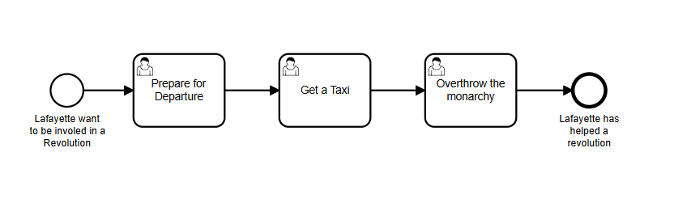

# 🚀 springboot-camunda-lafayette

Projeto de automação de workflows utilizando **Spring Boot** e **Camunda BPM**, com suporte a modelagem BPMN, execução de processos e interface web integrada.

---

## 🧠 Stack Tecnológica

* **Java 17**
* **Spring Boot 2.7.18**
* **Camunda BPM 7.19**
* **H2 Database (in-memory)**
* **Spring JDBC**
* **Camunda Webapp (Cockpit / Tasklist / Admin)**

---

## 📦 Dependências Principais

* `camunda-bpm-spring-boot-starter`
* `camunda-bpm-spring-boot-starter-webapp`
* `camunda-engine-plugin-spin`
* `camunda-spin-dataformat-json-jackson`
* `spring-boot-starter-web`
* `spring-boot-starter-jdbc`
* `h2`

---

## ▶️ Como Executar

### Pré-requisitos

* Java 17+
* Maven 3.8+

### Passos

```bash
# Clonar o repositório
git clone <repo-url>

# Entrar no diretório
cd springboot-camunda-lafayette

# Rodar a aplicação
mvn spring-boot:run
```

---

## 🌐 Acessos

Após subir a aplicação:

* Camunda Cockpit:
  `http://localhost:8080/camunda`

* Tasklist:
  `http://localhost:8080/camunda/app/tasklist`

* Admin:
  `http://localhost:8080/camunda/app/admin`

### Credenciais padrão

```
user: demo
password: demo
```

---

## 🗄️ Banco de Dados

* Banco em memória **H2**
* Console (se habilitado):
  `http://localhost:8080/h2-console`

Configuração padrão:

```
JDBC URL: jdbc:h2:mem:camunda-h2-database
User: sa
Password: (vazio)
```

---


## 🔄 Camunda BPM

Este projeto utiliza:

* **BPMN 2.0** para definição de processos
* **Delegates Java** para lógica de execução
* **Spin (JSON)** para manipulação de dados

---

## 🧪 Desenvolvimento

Hot reload habilitado com:

```
spring-boot-devtools
```

Ideal para acelerar desenvolvimento local.

---

## 📌 Observações Técnicas

* Versão 2.7 do Spring Boot → última linha antes do Spring Boot 3 (Jakarta)
* Camunda 7 (engine embedded) → arquitetura monolítica leve
* H2 → recomendado apenas para dev/teste (usar PostgreSQL em produção)

---

## Parte Um: A Partida de Lafayette
### Usando tarefas de usuário e formulários do Camunda.



